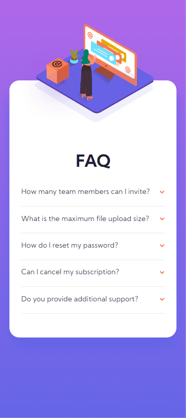

# Frontend Mentor - Faq Accordion Card Main

This is a solution to the [Faq Accordion Card Main page challenger on Frontend Mentor](https://www.frontendmentor.io/challenges/faq-accordion-card-XlyjD0Oam). Frontend Mentor challenges help you improve your coding skills by building realistic projects. 

## Table of contents

- [Overview](#overview)
  - [The challenge](#the-challenge)
  - [Screenshot](#screenshot)
- [My process](#my-process)
  - [Built with](#built-with)
  - [What I learned](#what-i-learned)
- [Author](#author)

**Note: Delete this note and update the table of contents based on what sections you keep.**

## Overview

### The challenge

Users should be able to:

- View the optimal layout for the component depending on their device's screen size
- See hover states for all interactive elements on the page
- Hide/Show the answer to a question when the question is clicked

### Screenshot

## My process

### Built with

- Semantic HTML5 markup
- CSS custom properties
- Flexbox
- Grid
- Responsive
- Mobile-first workflow
- BEM methodology
- JS ES6 - Arrow function, const, forEach, DOM manipulation

### What I learned

- [BEM](http://getbem.com/introduction/) - methodology BEM(Block Element Modifier)
- [Overflow](https://developer.mozilla.org/en-US/docs/Web/CSS/overflow) - property overflow css

## Author

- Linkedin - [Marcos](https://www.linkedin.com/in/marcos-doriguetto/)
- Twitter - [@marcosdori](https://www.twitter.com/marcosdori)

